# **SnackStack — Console-Based Sandwich Ordering App**

SnackStack is a Java console application that allows users to build custom sandwiches, order drinks and chips, and check out with a fully itemized receipt.
It features clean UI menus, input validation, signature sandwich options, and a flexible object-oriented design.

---

## 🚀 **Features**

### **✔ Interactive Console UI**

* Home screen menu
* Order menu (sandwiches, drinks, chips, checkout)
* Clear ASCII-styled menu headers
* Input validation using a dedicated `InputParser` utility

### **✔ Sandwich Builder**

* Choose bread, size, meat, cheese, toppings, sauces
* Optional toasting
* Premium topping pricing based on sandwich size
* Signature (pre-made) sandwiches included

### **✔ Order Management**

* Add multiple sandwiches, drinks, or chips
* View cart prior to checkout
* Accurate price calculation with base price + extras
* Final receipt with detailed summary and total

### **✔ Object-Oriented Design**

* `Sandwich`, `Drink`, `Chips`, and `Order` model classes
* `Valuable` interface with standardized `getPrice()` + `getDescription()`
* `UserInterface` handles all customer interaction
* `SnackStackApp` serves as the program’s entry point

---

## 📂 **Project Structure**

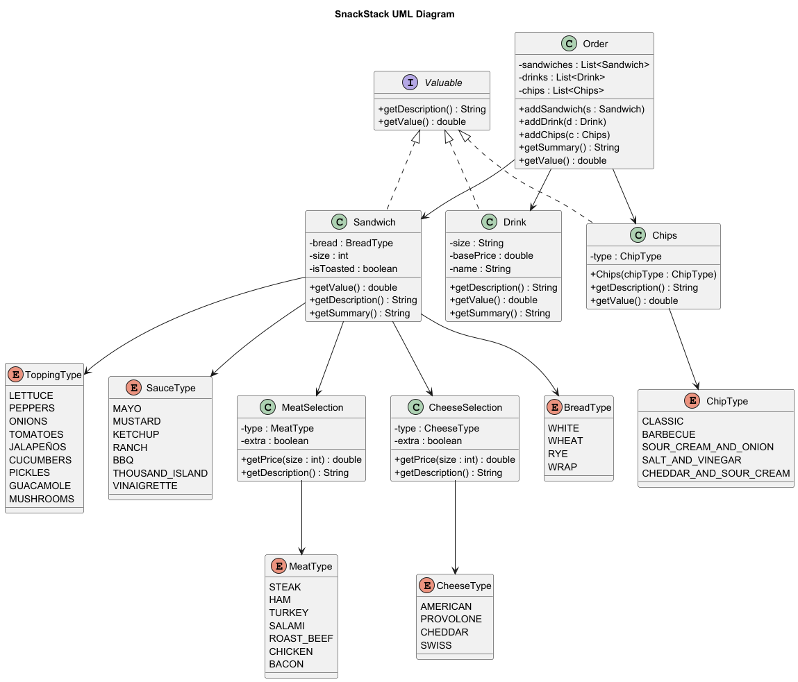

---

## 🧪 **How to Run the Application**

1. Clone or download this repository
2. Open it in your IDE (IntelliJ, Eclipse, VS Code, etc.)
3. Compile with Java 17+
4. Run the `SnackStackApp` class

```bash
javac SnackStackApp.java
java SnackStackApp
```

---

## 🍞 **Menu Overview**

### **Signature Sandwiches**

Premade options such as:

* The Classic Italian
* The Veggie Delight
* The Meat Lover
  (All toasted by default)

### **Custom Sandwich Options**

Users can select:

* Bread Type
* Size (4", 8", 12")
* Meats (priced by size)
* Cheeses (priced by size)
* Standard toppings (free)
* Sauces (free)
* Toasted or not toasted

---

## 💵 **Pricing System**

### **Base Sandwich Prices**

| Size | Price |
| ---- | ----- |
| 4"   | $5.50 |
| 8"   | $7.00 |
| 12"  | $8.50 |

---

## 🥩 **Meats (Premium Toppings)**

| **Type**   | **4"** | **8"** | **12"** |
| ---------- | ------ | ------ | ------- |
| Steak      | $1.00  | $2.00  | $3.00   |
| Ham        | $1.00  | $2.00  | $3.00   |
| Salami     | $1.00  | $2.00  | $3.00   |
| Roast Beef | $1.00  | $2.00  | $3.00   |
| Chicken    | $1.00  | $2.00  | $3.00   |
| Bacon      | $1.00  | $2.00  | $3.00   |
| Extra Meat | $0.50  | $1.00  | $1.50   |

---

## 🧀 **Cheeses (Premium Toppings)**

| **Type**     | **4"** | **8"** | **12"** |
| ------------ | ------ | ------ | ------- |
| American     | $0.75  | $1.50  | $2.25   |
| Provolone    | $0.75  | $1.50  | $2.25   |
| Cheddar      | $0.75  | $1.50  | $2.25   |
| Swiss        | $0.75  | $1.50  | $2.25   |
| Extra Cheese | $0.30  | $0.60  | $0.90   |

---

### **Drinks**

Small, Medium, Large

### **Chips**

Classic flavors based on `ChipType` enum

---
## 📸 Application Screens

### 🏠 Home Screen
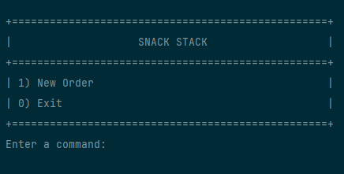
### 🧾 Order Screen
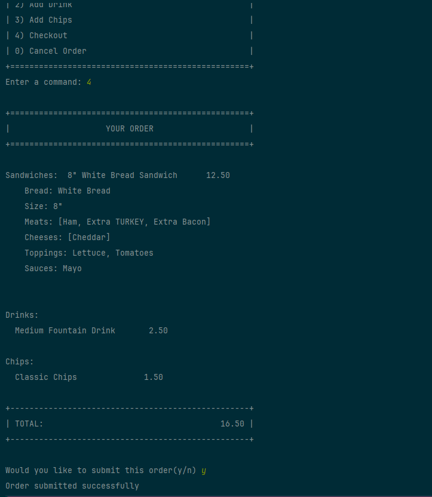
### 🥪 Add Sandwich Screen
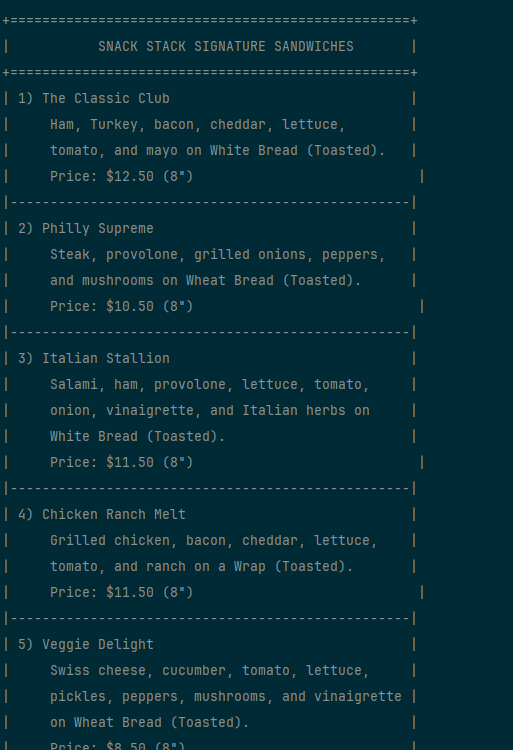
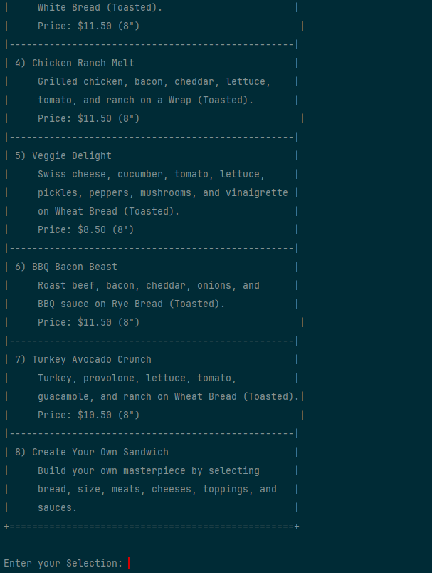
### 🥤 Add Drink Screen
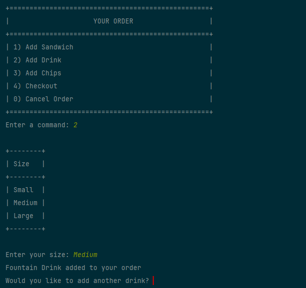
### 🍟 Add Chips Screen
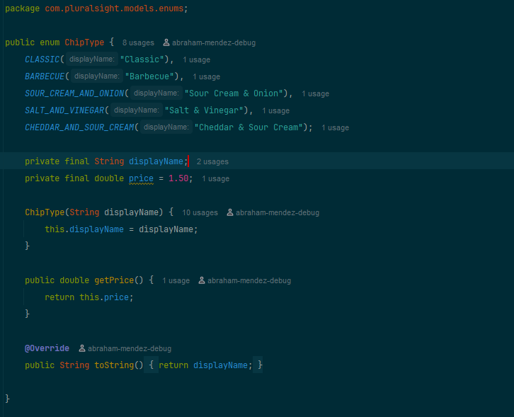
### 💳 Checkout Screen
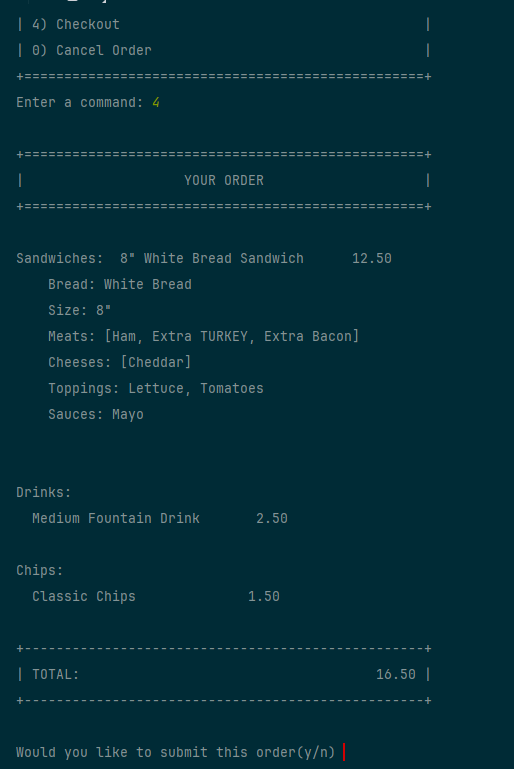

---
## 🛠️ Interesting Piece of Code: Enum-Driven Pricing System

One of the more interesting challenges in this project was building a scalable pricing system for meats, cheeses, and other premium toppings.

### ✔️ What I learned

How to design and use Java Enums with custom fields like displayName.

How to pair enums with HashMaps to store size-dependent pricing (4", 8", 12").

How to apply premium topping prices based on:

Sandwich size

Type of topping

Whether it's "extra"

### ✔️ Why it’s useful

This design:

Centralizes pricing logic

Makes menu changes much easier

Reduces duplicated logic inside the Sandwich class

Keeps the UI simple (only referencing display names)
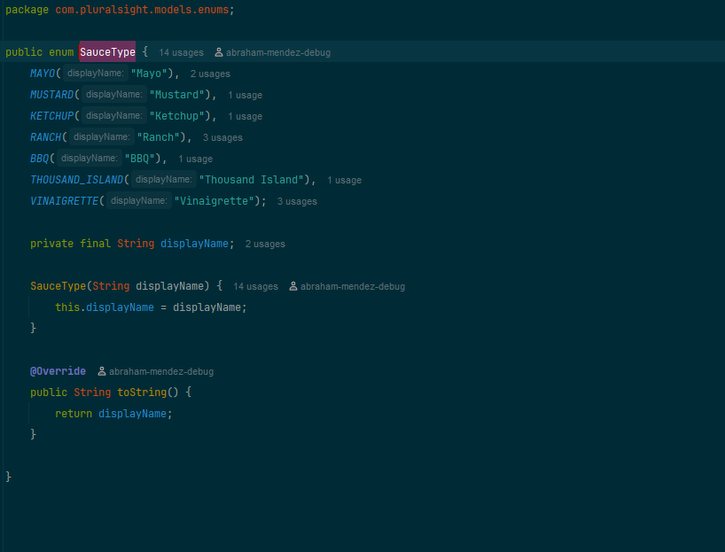
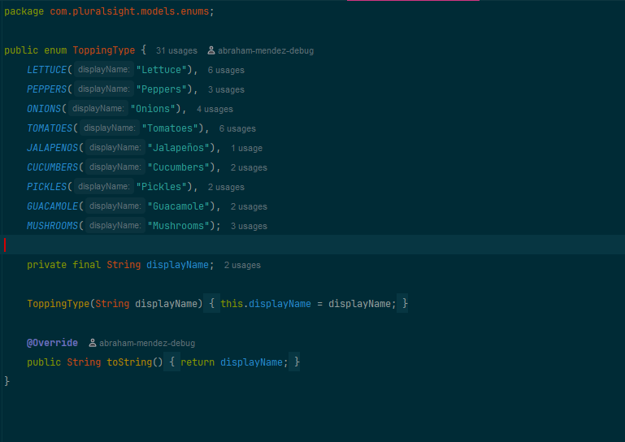

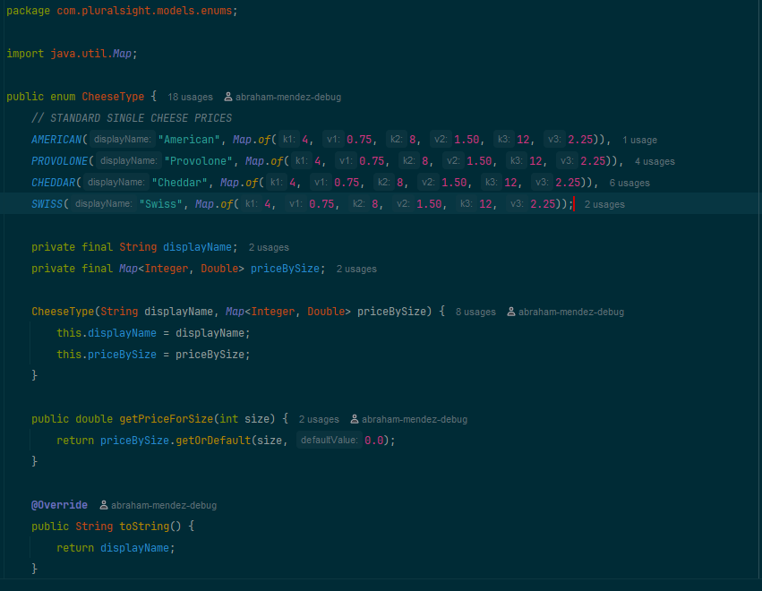
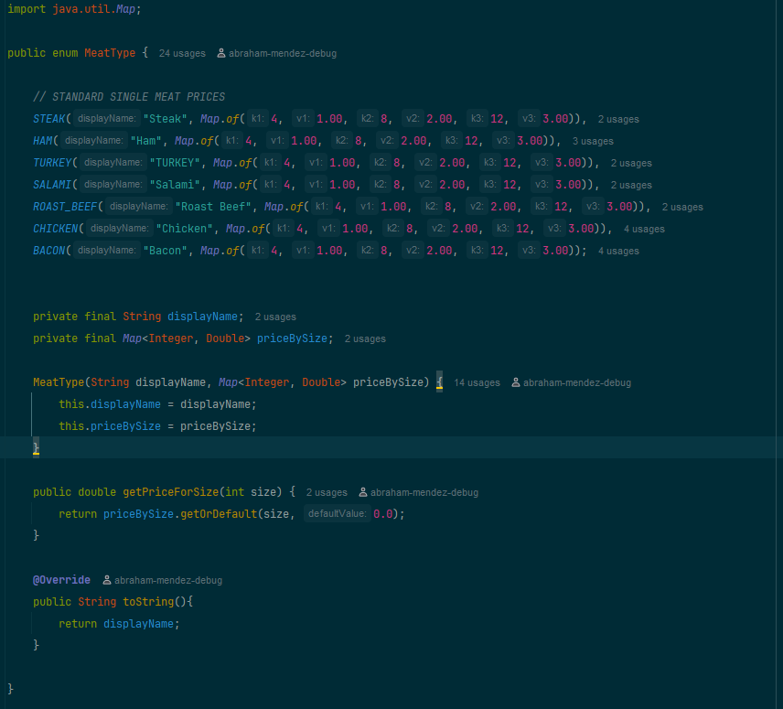
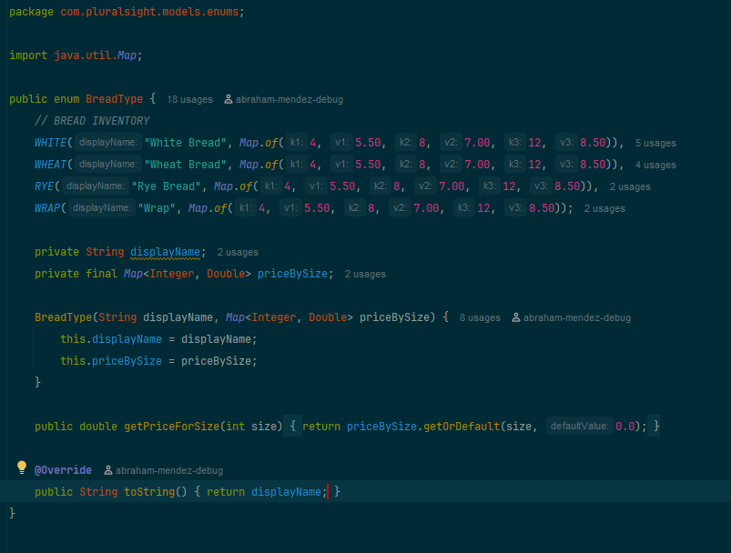
---


